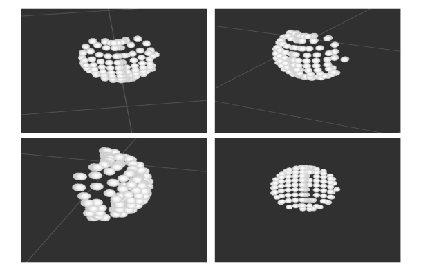

# Curvature based trajectory planning for robot endeffector in contact with objects

Implementation of a robotic system for a real time trajectory planning on robot arm
Schunk LWA4P Powerball. The alghorithm designs motion based on the curvature of
an object measured by a sensor based on the principles of Soft robotics. The motion is
realized with optimum motion time. The processed object is saved in Point Cloud data
structure and is available for further analysis.

This is a work done for bachelor thesis. Part of the code that relates to decription is done by me. I cannot take gratitude for majority of the code.

## Example
Simulation is done with a single robot and a sphere. 

 

